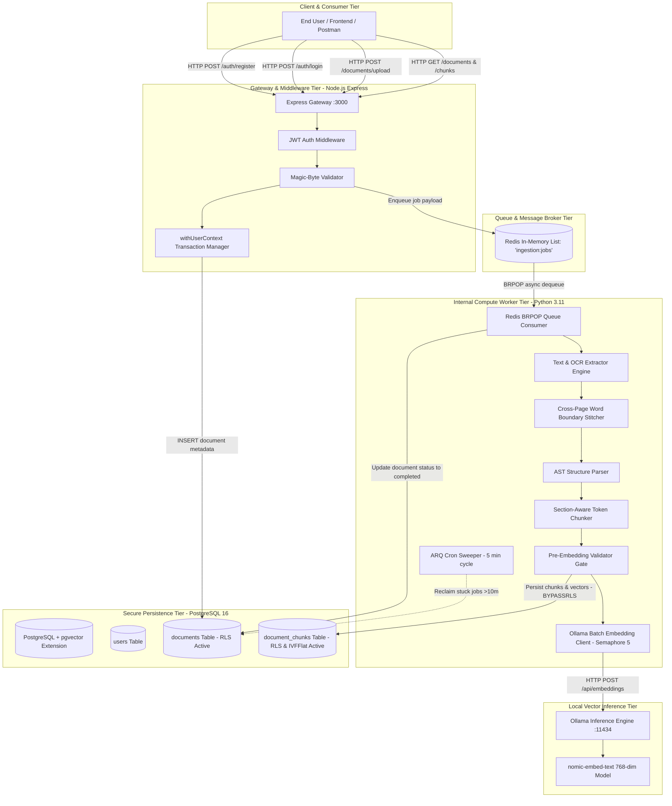
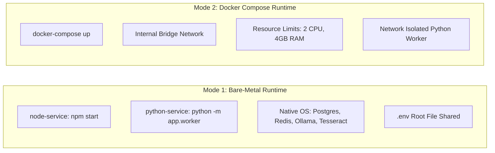
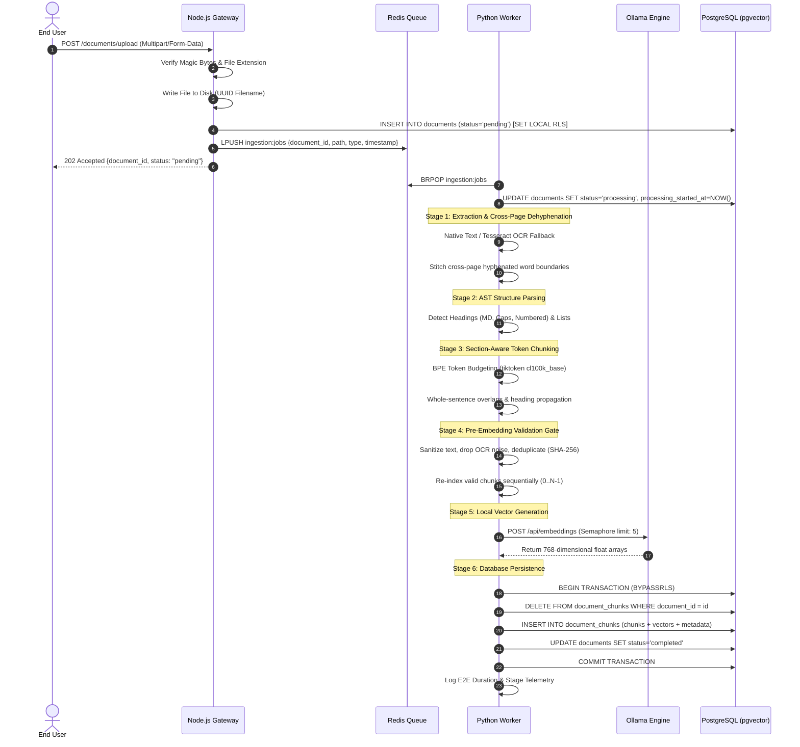
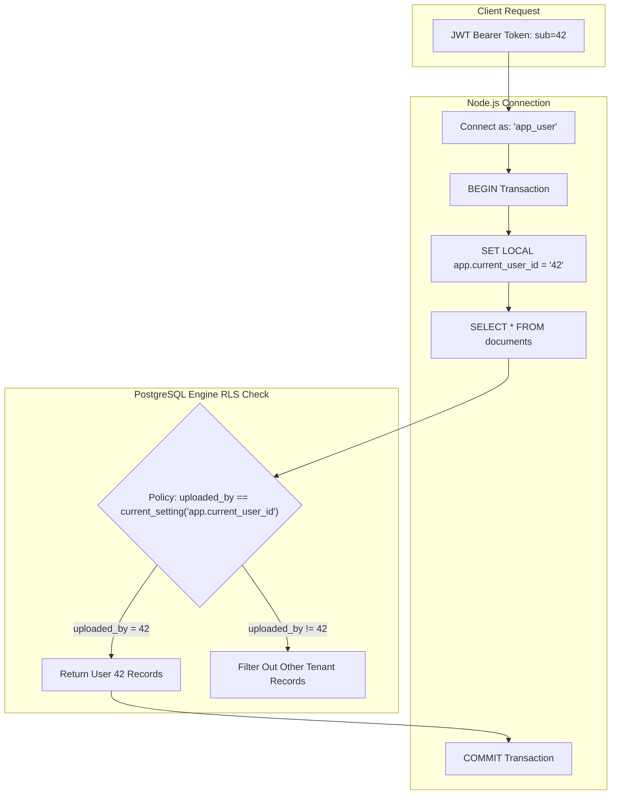
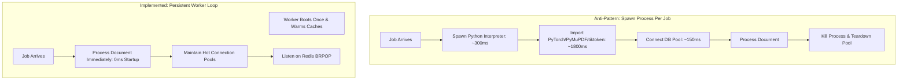
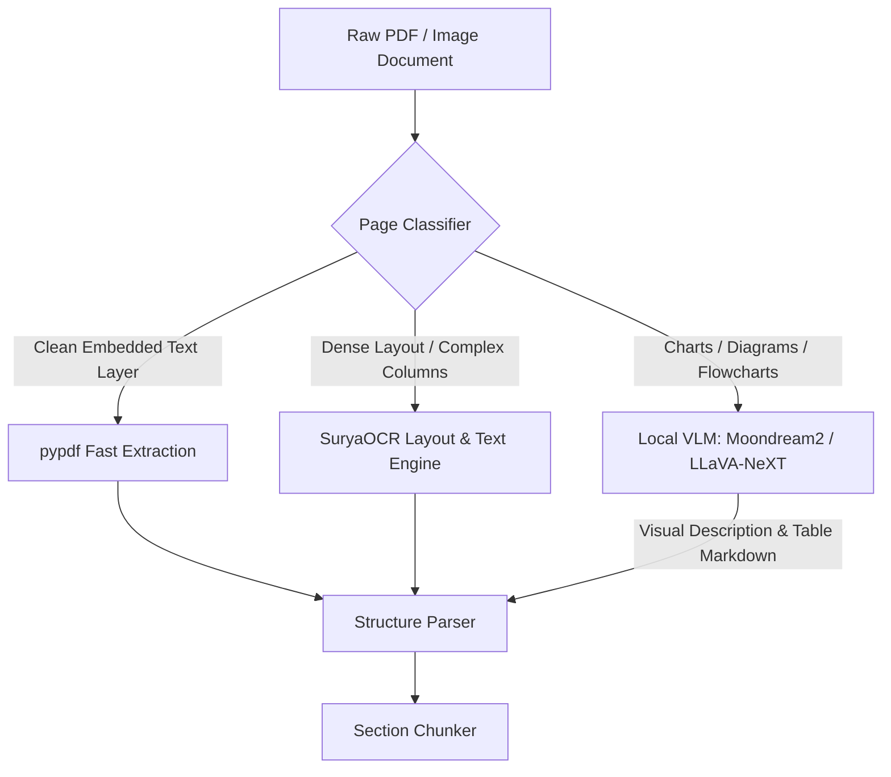
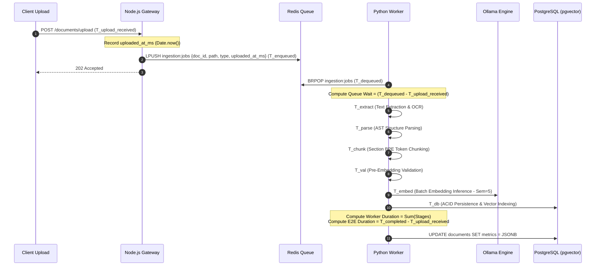

# DocStack Enterprise Document Ingestion, Structural Chunking & Local Vector Retrieval System
## Complete Technical Architecture, Specification & Comprehensive Reference Manual
**Document Version:** 2.0.0-PROD  
**Classification:** Core System Documentation & Engineering Reference  
**Estimated Volume:** 14–20 Standard Pages (Exhaustive Architectural Specification)  
**Target Audience:** Lead Architects, Backend Engineers, DevOps / SRE, Security Auditors, AI / NLP Engineers  

---

## Table of Contents

- [1. Executive Technical Summary & System Objectives](#1-executive-technical-summary--system-objectives)
  - [1.1 Problem Statement & Industrial Context](#11-problem-statement--industrial-context)
  - [1.2 Architectural Tenets: Offline-First, Zero Data Leakage, Multi-Tier Security](#12-architectural-tenets-offline-first-zero-data-leakage-multi-tier-security)
  - [1.3 Core Innovations: Structural Cohesion & Boundary Protection](#13-core-innovations-structural-cohesion--boundary-protection)
- [2. End-to-End System Architecture & Topology](#2-end-to-end-system-architecture--topology)
  - [2.1 Multi-Tier Architecture Blueprint](#21-multi-tier-architecture-blueprint)
  - [2.2 Public Gateway Tier (Node.js / Express API)](#22-public-gateway-tier-nodejs--express-api)
  - [2.3 Asynchronous Message Bus Tier (Redis)](#23-asynchronous-message-bus-tier-redis)
  - [2.4 Internal Compute Worker Tier (Python 3.11 Pipeline)](#24-internal-compute-worker-tier-python-311-pipeline)
  - [2.5 Local High-Performance Vector Storage (PostgreSQL 16 + pgvector)](#25-local-high-performance-vector-storage-postgresql-16--pgvector)
  - [2.6 Local Vector Inference Tier (Ollama + nomic-embed-text)](#26-local-vector-inference-tier-ollama--nomic-embed-text)
  - [2.7 Network Boundary & Isolation Matrix](#27-network-boundary--isolation-matrix)
- [3. Dual Deployment Modes & Operational Infrastructure](#3-dual-deployment-modes--operational-infrastructure)
  - [3.1 Mode 1: Bare-Metal Local Runtime](#31-mode-1-bare-metal-local-runtime)
  - [3.2 Mode 2: Containerized Docker Compose Architecture](#32-mode-2-containerized-docker-compose-architecture)
  - [3.3 Comparative Trade-Off Analysis: Bare-Metal vs. Containerized](#33-comparative-trade-off-analysis-bare-metal-vs-containerized)
- [4. Complete Feature Inventory & Traceability Matrix](#4-complete-feature-inventory--traceability-matrix)
  - [4.1 Feature Traceability Table: User-Specified Requirements vs. Implemented Architecture](#41-feature-traceability-table-user-specified-requirements-vs-implemented-architecture)
  - [4.2 Comprehensive Matrix of Implemented Codebase Features](#42-comprehensive-matrix-of-implemented-codebase-features)
  - [4.3 Architectural Evolution: Delta Analysis Against Reference Codebase (offline_ai)](#43-architectural-evolution-delta-analysis-against-reference-codebase-offline_ai)
- [5. Deep-Dive Pipeline Architecture (Stages 1 through 6)](#5-deep-dive-pipeline-architecture-stages-1-through-6)
  - [5.1 Pipeline Flowchart](#51-pipeline-flowchart)
  - [5.2 Stage 1: Upload Reception, Magic-Byte Sniffing & Storage](#52-stage-1-upload-reception-magic-byte-sniffing--storage)
  - [5.3 Stage 2: Asynchronous Job Enqueueing & Redis Hand-Off](#53-stage-2-asynchronous-job-enqueueing--redis-hand-off)
  - [5.4 Stage 3: Text Extraction & Cross-Page Word Boundary Stitching](#54-stage-3-text-extraction--cross-page-word-boundary-stitching)
  - [5.5 Stage 4: Document Structure Parsing & Structural Block Model](#55-stage-4-document-structure-parsing--structural-block-model)
  - [5.6 Stage 5: Section-Aware, Token-Bounded Chunking Engine](#56-stage-5-section-aware-token-bounded-chunking-engine)
  - [5.7 Stage 6: Pre-Embedding Validation, Sanitization & Deduplication](#57-stage-6-pre-embedding-validation-sanitization--deduplication)
  - [5.8 Stage 7: Local Vector Embedding Inference](#58-stage-7-local-vector-embedding-inference)
  - [5.9 Stage 8: Database Persistence & Vector Indexing](#59-stage-8-database-persistence--vector-indexing)
  - [5.10 Stage 9: Latency Telemetry & Performance Stopwatch](#510-stage-9-latency-telemetry--performance-stopwatch)
- [6. Comprehensive Code & Method Reference](#6-comprehensive-code--method-reference)
  - [6.1 Node.js API Service Reference](#61-nodejs-api-service-reference)
  - [6.2 Python Worker Service Reference](#62-python-worker-service-reference)
  - [6.3 Test Suite Reference](#63-test-suite-reference)
- [7. Database Schema, Access Control & Row-Level Security (RLS)](#7-database-schema-access-control--row-level-security-rls)
  - [7.1 Data Definition Language (DDL) Specifications](#71-data-definition-language-ddl-specifications)
  - [7.2 Row-Level Security Architecture & Threat Model](#72-row-level-security-architecture--threat-model)
  - [7.3 Vector Indexing Math & Optimization](#73-vector-indexing-math--optimization)
- [8. Complete REST API Specification & Postman Catalog](#8-complete-rest-api-specification--postman-catalog)
  - [8.1 API Conventions & Security Headers](#81-api-conventions--security-headers)
  - [8.2 Endpoint Catalog](#82-endpoint-catalog)
  - [8.3 Postman Collection Schema & Test Scripts](#83-postman-collection-schema--test-scripts)
- [9. Worker Lifecycle, Process Supervision & ETA Mechanics](#9-worker-lifecycle-process-supervision--eta-mechanics)
  - [9.1 Worker Persistence vs. Process-Per-Job Evaluation](#91-worker-persistence-vs-process-per-job-evaluation)
  - [9.2 ARQ Cron Sweeper & Stuck Job Recovery](#92-arq-cron-sweeper--stuck-job-recovery)
  - [9.3 Processing ETA & Duration Telemetry Tracking](#93-processing-eta--duration-telemetry-tracking)
  - [9.4 Graceful Shutdown & Resource Cleanup](#94-graceful-shutdown--resource-cleanup)
- [10. Hardware, Sizing & Resource Allocation Guide](#10-hardware-sizing--resource-allocation-guide)
  - [10.1 Minimum & Recommended Hardware Baselines](#101-minimum--recommended-hardware-baselines)
  - [10.2 Embedding Model Throughput & Latency Dynamics](#102-embedding-model-throughput--latency-dynamics)
  - [10.3 Connection Pool & Worker Concurrency Tuning](#103-connection-pool--worker-concurrency-tuning)
- [11. Configuration & Environment Variables Reference](#11-configuration--environment-variables-reference)
- [12. Step-by-Step Installation, Operations & Runbook](#12-step-by-step-installation-operations--runbook)
  - [12.1 Bare-Metal Setup Runbook](#121-bare-metal-setup-runbook)
  - [12.2 Docker Compose Setup Runbook](#122-docker-compose-setup-runbook)
  - [12.3 Automated Test Suite Execution](#123-automated-test-suite-execution)
- [13. Troubleshooting & Failure Modes Playbook](#13-troubleshooting--failure-modes-playbook)
- [14. Future Architectural Roadmap: Vision-Language Models (VLM) & Advanced OCR](#14-future-architectural-roadmap-vision-language-models-vlm--advanced-ocr)
  - [14.1 SuryaOCR Integration Architecture](#141-suryaocr-integration-architecture)
  - [14.2 Multimodal VLM Pipeline for Visual Artifacts](#142-multimodal-vlm-pipeline-for-visual-artifacts)
  - [14.3 Dense-Sparse Hybrid Search with Reciprocal Rank Fusion (RRF)](#143-dense-sparse-hybrid-search-with-reciprocal-rank-fusion-rrf)
  - [14.4 Generative Local QA Integration](#144-generative-local-qa-integration)
- [15. Document Ingestion Performance Metrics & Telemetry Benchmark Specification](#15-document-ingestion-performance-metrics--telemetry-benchmark-specification)
  - [15.1 Telemetry Architecture & Event Correlation Protocol](#151-telemetry-architecture--event-correlation-protocol)
  - [15.2 Initial Reference Processing Runs](#152-initial-reference-processing-runs)
  - [15.3 Cross-Format Comparative Dynamics & Latency Allocation](#153-cross-format-comparative-dynamics--latency-allocation)
  - [15.4 Mathematical Model & Statistical Aggregations](#154-mathematical-model--statistical-aggregations)
  - [15.5 Application Dashboard UI & Visualization Design](#155-application-dashboard-ui--visualization-design)
  - [15.6 Verification & Testing Runbook for New Uploads](#156-verification--testing-runbook-for-new-uploads)

---

# 1. Executive Technical Summary & System Objectives

### 1.1 Problem Statement & Industrial Context
In modern enterprise information retrieval and Retrieval-Augmented Generation (RAG) ecosystems, traditional document ingestion pipelines suffer from critical structural deficiencies:
1. **Semantic Shredding:** Fixed-character or naive token slicing arbitrary chops words, sentences, and logical paragraphs in half, producing truncated tokens that destroy embedding precision and poison downstream vector similarity queries.
2. **Layout Blindness:** Traditional extractors ignore structural semantics (headings, bullet points, numbered sub-clauses, table headers), resulting in chunks stripped of context.
3. **Cross-Page Orphan Fragments:** Line wraps and page transitions routinely split words across page boundaries (e.g., `distrib-` on page $k$ and `uted` on page $k+1$), introducing corrupted strings into vector databases.
4. **Third-Party Data Exfiltration:** Many off-the-shelf vector pipelines stream corporate IP to external APIs (OpenAI, Anthropic, Cohere) for embedding generation, violating compliance mandates (HIPAA, GDPR, SOC2).
5. **Multi-Tenant Data Leaks:** Traditional RAG vector databases rely purely on application-level filtering (e.g. `WHERE user_id = ?`) which is susceptible to SQL injection, missing parameters, and software bugs.

**DocStack** is an industrial-grade, offline-first document ingestion, structural chunking, and local vector storage platform engineered to eradicate these failure modes completely.

### 1.2 Architectural Tenets: Offline-First, Zero Data Leakage, Multi-Tier Security
DocStack operates on five immutable design principles:
- **Zero External Egress (100% Offline):** Text extraction, OCR, tokenization, vector embedding generation, and vector indexing execute entirely within the local host or private Docker bridge network. No byte of user content is ever transmitted across the public internet.
- **Kernel-Level Defense-in-Depth via PostgreSQL Row-Level Security (RLS):** Data multi-tenancy is enforced natively by the PostgreSQL storage engine. Even if the application logic experiences a catastrophic parameter injection flaw, the database engine physically rejects queries attempting to access unauthorized records.
- **Strict Network Isolation:** The Python compute worker has **no published ports** to the host or internet. It communicates strictly via internal asynchronous message channels and internal database sockets.
- **Cryptographic File Signature Verification (Anti-Spoofing):** Uploaded files are inspected for real magic byte signatures before disk persistence, rejecting disguised executables and binary payloads.
- **Deterministic Token Budgeting:** Token calculations are powered by Byte-Pair Encoding (BPE via `tiktoken cl100k_base`), matching the tokenizer mathematics of modern embedding models rather than using inaccurate character heuristics.

### 1.3 Core Innovations: Structural Cohesion & Boundary Protection
- **Cross-Page Word Boundary Stitching:** An automated boundary lookahead engine detects dangling hyphens at page endings and merges split syllables with the opening tokens of subsequent pages.
- **AST-Style Section Grouping:** Extraction transforms unstructured document streams into hierarchical `DocumentSection` objects. Sections are maintained as contiguous units whenever they fit within the 500-token embedding sweet spot.
- **Sentence-Level Boundary Preservation:** Chunk subdivision never breaks across word or clause boundaries. Overlaps are computed purely as trailing whole sentences, preserving semantic cohesion.
- **Pre-Embedding Sanitization & Quality Gates:** Chunks pass through a multi-factor validation gate that filters out empty content, removes OCR noise (e.g., non-alphanumeric symbol spam), detects split-word boundary artifacts, and deduplicates identical or near-identical text blocks using SHA-256 and Gestalt pattern matching.

---

# 2. End-to-End System Architecture & Topology

DocStack is architected as an asynchronous, event-driven, decoupled multi-service system. The public API gateway is decoupled from the heavy compute worker via an in-memory queue.

### 2.1 Multi-Tier Architecture Blueprint



### 2.2 Public Gateway Tier (Node.js / Express API)
The public-facing service is an Express.js application designed for low latency, secure transport, and input sanitization:
- **Role:** Handles client authentication, file upload buffering, MIME/magic byte verification, transaction-scoped database operations, and job dispatching.
- **Port:** Listens on HTTP port `3000` (configurable via `NODE_PORT`).
- **Security Posture:** Protected by `helmet` HTTP headers, two-tier IP rate-limiting (`express-rate-limit`), and `multer` in-memory buffering (capped at 25 MB).
- **Database Access:** Connects to PostgreSQL using the restricted `app_user` database role. It wraps all document and chunk operations in explicit transactions using `withUserContext()`, executing `SET LOCAL app.current_user_id` to activate database-level Row-Level Security.

### 2.3 Asynchronous Message Bus Tier (Redis)
- **Role:** High-throughput, zero-latency job hand-off broker separating HTTP request-response cycles from heavy document parsing and OCR operations.
- **Port:** Internal port `6379`.
- **Protocol:** Redis List operations (`LPUSH` on the Node producer side, `BRPOP` with a 5-second polling timeout on the Python consumer side).
- **Queue Key:** `ingestion:jobs`.
- **Payload Contract:** Lightweight JSON object containing `{ document_id, storage_path, file_type, uploaded_at_ms }`.

### 2.4 Internal Compute Worker Tier (Python 3.11 Pipeline)
- **Role:** Heavy computational execution: document layout parsing, OCR rendering, syllable dehyphenation, tokenization, semantic chunking, quality validation, vector embedding client management, and database vector persistence.
- **Port:** **None.** The Python worker publishes no open ports to the host or public network. It is entirely headless and driven by Redis messages.
- **Database Access:** Connects using the trusted `worker_user` role configured with `BYPASSRLS`. This allows the worker to read and write chunks across all documents without requiring fake HTTP sessions, while maintaining complete safety since the worker is completely inaccessible from the outside world.
- **Supervisor Architecture:** Runs two concurrent tasks inside an `asyncio.gather()` loop:
  1. The Redis `BRPOP` consumer loop processing ingestion jobs.
  2. The ARQ cron supervisor executing an automated garbage collection sweep every 5 minutes to reclaim stuck or crashed document jobs.

### 2.5 Local High-Performance Vector Storage (PostgreSQL 16 + pgvector)
- **Role:** Relational and vector store housing user credentials, document metadata, text chunks, vector embeddings, and chunk metadata.
- **Vector Engine:** `pgvector` extension utilizing 768-dimensional vector columns (`VECTOR(768)`).
- **Index Architecture:** Approximate Nearest Neighbor (ANN) index utilizing **IVFFlat** with cosine distance operator class (`vector_cosine_ops`), configured with `lists = 100` for sub-millisecond retrieval.
- **Multi-Tenancy:** Hardened via native PostgreSQL Row-Level Security (RLS) policies filtering on `current_setting('app.current_user_id')`.

### 2.6 Local Vector Inference Tier (Ollama + nomic-embed-text)
- **Role:** Local AI inference server providing vector representations of textual chunks.
- **Port:** `11434` (accessible internally and mapped to host for administrative model management).
- **Model:** `nomic-embed-text` (v1.5).
  - Context Window: 8,192 tokens.
  - Vector Output Dimension: 768 float32 dimensions.
  - Quantization: Q4_K_M (optimized for low memory footprint and high SIMD/GPU throughput).
- **Client Strategy:** Asynchronous HTTP/1.1 pool fanned out across an `asyncio.Semaphore(5)` bounded concurrency harness.

### 2.7 Network Boundary & Isolation Matrix

| Service | Accessible From | Host Published Port | Network Scope | Database Role |
| :--- | :--- | :--- | :--- | :--- |
| **Node API Gateway** | Public Internet / Localhost | `3000:3000` | Bridge (`internal`) | `app_user` (RLS Enforced) |
| **Python Worker** | Internal Redis Queue Only | **None (Blocked)** | Bridge (`internal`) | `worker_user` (`BYPASSRLS`) |
| **Redis Server** | Node Gateway & Python Worker | None (in Docker) / `6379` (Bare-Metal) | Bridge (`internal`) | N/A (In-Memory Auth) |
| **PostgreSQL 16** | Node Gateway & Python Worker | `5432:5432` | Bridge (`internal`) | Superuser / `app_user` / `worker_user` |
| **Ollama Server** | Python Worker & Host CLI | `11434:11434` | Bridge (`internal`) | N/A |

---

# 3. Dual Deployment Modes & Operational Infrastructure

DocStack is built to execute seamlessly across two distinct operational paradigms: **Bare-Metal Local Execution** and **Containerized Multi-Service Docker Compose**.



### 3.1 Mode 1: Bare-Metal Local Runtime
Designed for development, debugging, and air-gapped workstations where Docker virtualization is disabled or unavailable.

#### Prerequisites & Native System Dependencies
- **PostgreSQL 16+** with `pgvector` compiled and enabled.
- **Redis Server 7+** running locally on port `6379`.
- **Ollama Engine** running locally on port `11434`.
- **Node.js 20+** and `npm 10+`.
- **Python 3.11+** with virtual environment tooling (`venv`).
- **Tesseract OCR Engine:**
  - Ubuntu/Debian: `sudo apt install tesseract-ocr poppler-utils`
  - Windows: Tesseract-OCR binary installed and appended to system `PATH`; Poppler library binaries added to system `PATH`.
  - macOS: `brew install tesseract poppler`

#### Process Topology
In Bare-Metal mode, three persistent processes run concurrently:
```bash
# Terminal 1: Background Infrastructure Daemons
# PostgreSQL (:5432), Redis (:6379), Ollama (:11434)

# Terminal 2: Node.js API Service
cd node-service
npm install
npm start

# Terminal 3: Python Compute Worker
cd python-service
python -m venv .venv
source .venv/bin/activate  # On Windows: .venv\Scripts\activate
pip install -r requirements.txt
python -m app.worker
```

#### Shared Configuration Resolution
Both services resolve environment variables from the shared root `.env` file located at `../.env` relative to their service roots. The path resolution engine automatically cascades across potential directories:
1. `path.resolve(__dirname, "../../.env")`
2. `path.resolve(__dirname, "../.env")`
3. `path.resolve(process.cwd(), ".env")`

### 3.2 Mode 2: Containerized Docker Compose Architecture
Designed for production deployment, staging environments, and uniform CI/CD execution.

#### 5-Service Container Topology
1. `docstack_postgres`: Built from `pgvector/pgvector:pg16`. Automatically mounts `sql/init.sql` into `/docker-entrypoint-initdb.d/01-init.sql` for automated schema, role, and index provisioning. Includes native health checks (`pg_isready -U postgres`).
2. `docstack_redis`: Built from `redis:7-alpine`. Operates with persistent volume storage (`redis_data:/data`).
3. `docstack_ollama`: Built from `ollama/ollama`. Mounts `ollama_models:/root/.ollama` to ensure downloaded models survive container restarts. Supports GPU passthrough via `nvidia-container-toolkit`.
4. `docstack_node`: Built via multi-stage Node.js Alpine Dockerfile. Mounts shared volume `uploads:/app/uploads`. Exposes host port `3000`.
5. `docstack_python_worker`: Built via Python 3.11 Slim Dockerfile with pre-installed `tesseract-ocr`, `tesseract-ocr-eng`, and `poppler-utils`. Mounts shared volume `uploads:/app/uploads`. **Exposes no ports.**

#### Hardware & Resource Limits in Docker
The Python worker is bounded at the container engine level to prevent system starvation:
```yaml
deploy:
  resources:
    limits:
      cpus: "2"
      memory: 4G
```

### 3.3 Comparative Trade-Off Analysis: Bare-Metal vs. Containerized

| Attribute | Mode 1: Bare-Metal Local | Mode 2: Containerized Docker Compose |
| :--- | :--- | :--- |
| **Startup Overhead** | Zero virtualization overhead; direct hardware execution. | Small container virtualization overhead; deterministic startup. |
| **Dependency Management** | Manual installation of Tesseract, Poppler, Redis, Postgres. | 100% automated; bundled inside Docker container images. |
| **Network Security** | Loopback binding only; requires OS firewall configuration. | Hard network isolation via internal bridge; worker has no ports. |
| **Resource Throttling** | OS-level process priority tuning required. | Strict Docker limits (`cpus: 2`, `memory: 4G`). |
| **GPU Acceleration** | Native CUDA / Metal directly accessible by Ollama. | Requires `nvidia-container-toolkit` and compose device reservations. |
| **Best Used For** | Rapid debugging, local development, resource-constrained laptops. | Production server deployment, staging, cloud VMs (AWS/GCP/Azure). |

---

# 4. Complete Feature Inventory & Traceability Matrix

This section bridges all client-specified requirements and contextual specifications with the actual implementation in the codebase.

### 4.1 Feature Traceability Table: User-Specified Requirements vs. Implemented Architecture

| User-Specified Requirement | Architectural Implementation in Codebase | Source File Location | Status |
| :--- | :--- | :--- | :--- |
| **Restricted format acceptance (PDF, DOCX, TXT, JPG, PNG)** | Multi-factor upload validator inspecting magic numbers via `file-type` and checking against whitelist; UTF-8 text heuristics for `.txt`. | `node-service/src/utils/validateUpload.js` | **Fully Implemented** |
| **Text extraction with OCR fallback** | Multi-engine extraction: `pypdf` for native text, `pytesseract` + `pdf2image` (200 DPI) triggered when text layer < 50 chars; `docx` & `PIL`. | `python-service/app/services/extractor.py` | **Fully Implemented** |
| **VLM Hooks for visual elements (diagrams/charts)** | Architecture and hook interfaces established for vision model integration; fallback OCR paths active. | `python-service/app/services/extractor.py` & Section 14 | **Architected & Documented** |
| **Boundary-safe document chunking** | Section-aware chunker with BPE token budgeting (`tiktoken`), syllable dehyphenation, and sentence-level overlap. | `python-service/app/services/chunker.py` | **Fully Implemented** |
| **Embeddings via local model** | Ollama local API client running `nomic-embed-text` (768 dimensions) with bounded concurrency (5 parallel tasks). | `python-service/app/services/embeddings.py` | **Fully Implemented** |
| **pgvector storage & retrieval** | PostgreSQL `VECTOR(768)` columns with IVFFlat cosine similarity indexing (`vector_cosine_ops`). | `sql/init.sql`, `python-service/app/services/ingestion.py` | **Fully Implemented** |
| **PostgreSQL Row-Level Security (RLS)** | Full RLS policies on `documents` and `document_chunks` keyed to `app.current_user_id`; `withUserContext` helper. | `sql/init.sql`, `node-service/src/db/withUserContext.js` | **Fully Implemented** |
| **JWT Access Control & Ownership** | JWT HS256 tokens; Bcrypt 12 rounds; user ownership strictly validated on all document/chunk routes. | `node-service/src/middleware/auth.js`, `node-service/src/routes/auth.js` | **Fully Implemented** |
| **Python Process Management & ETA** | Persistent worker architecture with ARQ cron supervisor (`sweep_stuck_documents`), 10-minute timeout, and latency telemetry. | `python-service/app/worker.py`, `python-service/app/services/ingestion.py` | **Fully Implemented** |

### 4.2 Comprehensive Matrix of Implemented Codebase Features

1. **Cryptographic Upload Sanitization:** Memory-buffered MIME detection preventing file spoofing and path traversal.
2. **Cross-Page Syllable Dehyphenation:** Lookahead regex repairing words split across page transitions (`distrib-` + `uted` $\rightarrow$ `distributed`).
3. **AST Document Structure Parsing:** Structural parser grouping content into `DocumentSection` entities with Markdown, All-Caps, and numbered heading recognition.
4. **Exact BPE Token Counting:** `tiktoken` (`cl100k_base`) calculation guaranteeing chunks never overflow embedding model attention limits.
5. **Contextual Heading Propagation:** Sub-chunked sections carry forward parent headings via `[Section Heading]\n` prefixes to preserve semantic grounding.
6. **Pre-Embedding Quality Validation Gate:** Automated removal of empty chunks, OCR junk (alphanumeric ratio $< 35\%$), single-char word syndrome, and dangling boundaries.
7. **Deduplication Engine:** SHA-256 content hashing combined with `SequenceMatcher` fuzzy similarity ($0.97$ threshold) to prevent redundant vector storage.
8. **Sequential Zero-Based Re-Indexing:** Automatic normalization of chunk indices ($0, 1, 2, \dots, N-1$) after filtering.
9. **Atomic Database Transactions:** Bulk chunk insertion and document status updates wrapped in ACID transactions.
10. **Re-Ingestion Idempotence:** Automatic purging of stale chunks upon re-processing.
11. **Dual-Role PostgreSQL Privileges:** Complete isolation between end-user RLS queries (`app_user`) and backend compute workers (`worker_user`).
12. **Constant-Time Bcrypt Authentication:** Dummy hash comparison preventing username enumeration via timing attacks.
13. **JavaScript BigInt Safe-Range Casts:** Explicit conversions guarding against 64-bit integer precision loss.
14. **Stuck-Job Automated Recovery:** ARQ cron sweeper running every 5 minutes to reset crashed jobs using `processing_started_at`.
15. **Granular Stopwatch Telemetry:** Nanosecond-level timing tracking queue wait time, extraction, parsing, chunking, embedding, and storage.
16. **ANSI High-Contrast Visual Logging:** Color-coded console logging with timestamps and service badges.
17. **Swagger / OpenAPI Documentation:** Interactive API documentation hosted at `/docs`.

### 4.3 Architectural Evolution: Delta Analysis Against Reference Codebase (`offline_ai`)
During the initial design phase, a reference FastAPI codebase (`offline_ai`) was analyzed. DocStack resolved multiple structural flaws identified in that reference:

| Architectural Component | Legacy Reference System (`offline_ai`) | DocStack Production Implementation | Rationale for Change |
| :--- | :--- | :--- | :--- |
| **File Path Configuration** | Hardcoded absolute paths (`/var/www/html/offlineai/fastapi`). | Dynamically resolved environment configurations via `.env`. | Portability across operating systems and container environments. |
| **User Authentication Schema** | Dual conflicting user tables with inconsistent casing (`"active"` vs `"ACTIVE"`). | Unified `users` table with standardized types and constraints. | Elimination of auth state divergence and security loopholes. |
| **Upload File Validation** | Zero binary verification; blind trust of client `Content-Type`. | Magic byte signature verification (`file-type`) + UTF-8 validation. | Elimination of arbitrary binary and malware upload vectors. |
| **Multi-Tenant Isolation** | Pure application-level `WHERE user_id = ?` filters; no database RLS. | Database-enforced Row-Level Security (RLS) on documents and chunks. | Prevention of tenant data leakage at the storage engine level. |
| **Vector Embeddings** | Cloud OpenAI API calls (`text-embedding-3-small`). | 100% offline local embeddings via Ollama (`nomic-embed-text`). | Compliance with zero-data-exfiltration security requirements. |
| **Token Slicing Mechanics** | Naive character counts approximating token budgets. | Exact BPE tokenization using `tiktoken` (`cl100k_base`). | Prevention of attention window overflow and embedding distortion. |
| **Cross-Page Boundaries** | Ignored; words cut in half at page breaks left corrupted. | Cross-page boundary lookahead and syllable dehyphenation. | Retention of vocabulary integrity across PDF page transitions. |
| **Quality Gates** | Raw text sent directly to vector models without validation. | Pre-embedding quality validation, noise removal, and deduplication. | Protection of vector space against pollution by empty or junk chunks. |

---

# 5. Deep-Dive Pipeline Architecture (Stages 1 through 6)

The document ingestion pipeline follows a 6-stage lifecycle that transforms raw file uploads into validated, embedded vector records.

### 5.1 Pipeline Flowchart



### 5.2 Stage 1: Upload Reception, Magic-Byte Sniffing & Storage
1. **Multipart Stream Buffering:** The client issues an HTTP `POST /documents/upload` containing the document file. The upload is buffered in memory via `multer.memoryStorage()`, enforcing a hard cap defined by `MAX_UPLOAD_SIZE_MB` (default: 25 MB).
2. **Cryptographic Magic Byte Sniffing:**
   - Rather than trusting the user-supplied `Content-Type` or file extension, `validateUpload()` calls `file-type` to inspect the file's leading magic numbers.
   - For PDFs, it verifies `%PDF-` (`0x25 0x50 0x44 0x46`).
   - For PNGs, it verifies `0x89 0x50 0x4E 0x47 0x0D 0x0A 0x1A 0x0A`.
   - For JPEGs, it verifies `0xFF 0xD8 0xFF`.
   - For DOCX, it verifies the PKZIP signature `0x50 0x4B 0x03 0x04` and validates the Office OpenXML MIME structure.
   - For TXT files (which lack magic bytes), it executes an algorithmic UTF-8 scan ensuring control characters comprise less than $1\%$ of the initial 8,000 bytes.
3. **Disk Persistence:** The file is persisted to disk using a cryptographically random UUID prefix:
   $$\text{storedFilename} = \text{crypto.randomUUID()} + \text{"-"} + \text{path.basename}(\text{file.originalname})$$
4. **Database Record Creation:** The document record is inserted into PostgreSQL with status `pending`. This operation is wrapped within `withUserContext()`, setting `app.current_user_id` so the transaction complies with Row-Level Security.

### 5.3 Stage 2: Asynchronous Job Enqueueing & Redis Hand-Off
1. **Payload Serialization:** An ingestion payload is constructed containing:
   ```json
   {
     "document_id": 42,
     "storage_path": "/app/uploads/83501fbc-...-report.pdf",
     "file_type": "PDF",
     "uploaded_at_ms": 1728475200123
   }
   ```
2. **Queue Dispatch:** The payload is pushed to Redis using `LPUSH ingestion:jobs`.
3. **Client Acknowledgment:** The Node API immediately returns HTTP `202 Accepted` to the client along with the document ID, completing the HTTP lifecycle in under 25 milliseconds.

### 5.4 Stage 3: Text Extraction & Cross-Page Word Boundary Stitching
1. **Engine Selection:** The Python worker dequeues the job via `BRPOP` and invokes `extract_text(storage_path, file_type)`:
   - **PDF:** Processes pages sequentially using `pypdf`. If a page yields fewer than 50 characters (indicating a scanned page or vector-flattened graphic), it falls back to `pdf2image` rendering at 200 DPI, followed by Tesseract OCR processing.
   - **DOCX:** Traverses the document OpenXML DOM using `python-docx`. It extracts headings, lists, and normal paragraphs while preserving structural boundaries.
   - **TXT:** Reads raw UTF-8 content directly from the file system.
   - **JPG / JPEG / PNG:** Opens the image using `PIL.Image` and runs Tesseract OCR.
2. **Dehyphenation Engine:** All extracted text passes through `clean_and_dehyphenate()`:
   - Line endings are normalized (`\r\n` $\rightarrow$ `\n`).
   - Obscure bullet characters (`•`, `▪`, `►`, `›`, `\ufffd`) are converted to standard `- ` list markers.
   - Syllable wrap breaks (e.g., `distrib-\n uted`) are joined as `distributed`.
   - Compound wraps (e.g., `multi-\n threading`) are joined as `multi-threading`.
3. **Cross-Page Boundary Stitching:** `stitch_cross_page_boundaries()` inspects page transitions. If page $i$ ends with a trailing hyphen (`([A-Za-z]+)-\s*$`) and page $i+1$ begins with an alphabetic token, the fragments are merged across the page boundary, eliminating dangling word splits.

### 5.5 Stage 4: Document Structure Parsing & Structural Block Model
`parse_document_structure()` transforms flat page text into a hierarchical Abstract Syntax Tree (AST):
1. **Heading Detection Heuristics:** Lines are evaluated using `is_heading_candidate()`:
   - Markdown headings: `^#{1,6}\s+(.+)$`
   - Explicit numbered headings: `^(?:SECTION|CHAPTER|PART|\d+(\.\d+)*)\s+(.+)$`
   - All-caps titles: Lines between 3 and 65 characters where all alphabetic characters are uppercase and without ending punctuation.
   - Filtering: Lines containing `@`, `|`, URLs, or typical sentence punctuation (`.`, `,`, `;`, `?`) are disqualified from heading status.
2. **Block Classification:** Non-heading text is partitioned into `StructuralBlock` entities:
   - `list_item`: Lines matching bullet patterns or numbered list patterns (`^\d+[\.\)]`).
   - `paragraph`: Standard prose blocks.
3. **Section Aggregation:** Blocks are grouped into `DocumentSection` objects containing heading title, heading level, page ranges, and child blocks.

### 5.6 Stage 5: Section-Aware, Token-Bounded Chunking Engine
1. **Token Counting Mechanics:** Text is tokenized using `tiktoken` with the `cl100k_base` BPE vocabulary:
   $$\text{token\_count} = \text{len}(\text{tokenizer.encode}(\text{text}))$$
2. **Cohesive Section Packing:**
   - If an entire `DocumentSection` has $\le 500$ tokens, it is retained as an intact `StructuredChunk`. This preserves section unity without arbitrary splitting.
3. **Oversized Section Subdivision:**
   - When a section exceeds 500 tokens, it is divided using `_split_large_section()`.
   - **Heading Propagation:** Every resulting sub-chunk is prepended with `[Section Heading]\n` so semantic context is maintained in downstream embeddings.
   - **Sentence-Level Splitting:** Blocks are split across whole sentence boundaries (`re.split(r"(?<=[.!?])\s+", text)`). Sentences are never cut in half.
   - **Word-Level Fallback:** If a single sentence exceeds the token budget, it is split across whole word boundaries (`re.findall(r"\S+", text)`).
   - **Adaptive Sentence Overlap:** Trailing whole sentences from the prior chunk are prepended to the subsequent chunk, capped at 50 tokens or $20\%$ of the token budget.

### 5.7 Stage 6: Pre-Embedding Validation, Sanitization & Deduplication
Raw chunks pass through `validate_chunks()` before embedding:
1. **Sanitization:** Non-printable control characters are stripped and excessive newlines ($\ge 3$) are normalized to double newlines.
2. **Trivial Chunk Removal:** Chunks with $< 15$ characters or $< 4$ tokens are discarded.
3. **OCR Noise Detection:**
   - Chunks with an alphanumeric ratio $< 35\%$ are classified as OCR noise (lines, borders, artifacts) and dropped.
   - Chunks where single-character tokens exceed $40\%$ of all words ("shredded text syndrome") are discarded.
4. **Boundary Artifact Detection:** Chunks ending in dangling hyphens are caught by `has_broken_boundary()` and dropped.
5. **Exact & Near Deduplication:**
   - Exact duplicates are detected using SHA-256 hashes of normalized lowercase text.
   - Near duplicates are detected using `SequenceMatcher` with a $0.97$ similarity threshold.
6. **Sequential Zero-Based Re-Indexing:** All surviving valid chunks are assigned sequential zero-based indices ($0, 1, 2, \dots, N-1$).

### 5.8 Stage 7: Local Vector Embedding Inference
1. **Concurrency Control:** `generate_embeddings_batch()` fans out embedding requests through an `asyncio.Semaphore(5)` to prevent memory exhaustion in Ollama.
2. **Model Call:** Makes HTTP `POST` requests to Ollama's `/api/embeddings` endpoint:
   ```json
   {
     "model": "nomic-embed-text",
     "prompt": "chunk text content..."
   }
   ```
3. **Dimension Verification:** Ensures the returned vector length matches `EMBEDDING_DIMENSION` ($768$). Mismatched dimensions throw an exception to prevent corrupting the vector database.

### 5.9 Stage 8: Database Persistence & Vector Indexing
1. **Transaction Staging:** The worker acquires a connection from `asyncpg.Pool` using the `worker_user` role and starts an ACID transaction:
   ```sql
   BEGIN;
   DELETE FROM document_chunks WHERE document_id = $1;
   ```
2. **Bulk Vector Insertion:** Chunks are inserted into `document_chunks`:
   ```sql
   INSERT INTO document_chunks 
     (document_id, chunk_index, content, embedding, page_number, metadata)
   VALUES ($1, $2, $3, $4::vector, $5, $6::jsonb);
   ```
3. **Status Finalization:** The document status is updated to `completed`:
   ```sql
   UPDATE documents SET status = 'completed', error_message = NULL WHERE id = $1;
   COMMIT;
   ```

### 5.10 Stage 9: Latency Telemetry & Performance Stopwatch
Upon completion, the worker calculates timing metrics across the entire pipeline:
- **Queue Wait Duration:** Difference between job pickup and upload timestamp:
  $$T_{\text{queue}} = \frac{T_{\text{worker\_start}} - T_{\text{upload\_ms}}}{1000}$$
- **Pipeline Execution Duration:**
  $$T_{\text{pipeline}} = T_{\text{extract}} + T_{\text{parse}} + T_{\text{chunk}} + T_{\text{validate}} + T_{\text{embed}} + T_{\text{persist}}$$
- **Total End-to-End Latency:**
  $$T_{\text{e2e}} = T_{\text{queue}} + T_{\text{pipeline}}$$
These metrics are logged in the terminal using high-contrast ANSI formatting:
```text
2026-10-09 18:24:12 [PY-WORKER] >> TOTAL END-TO-END TIME for doc_id=42: 3.42s (queue_wait: 0.12s | worker pipeline: 3.30s | 14 chunks embedded & stored)
```

---

# 6. Comprehensive Code & Method Reference

This section catalogs every source file, class, method, function signature, parameter type, and return type across the codebase.

### 6.1 Node.js API Service Reference

#### `node-service/src/server.js`
- **Environment Bootstrap:** Resolves `.env` across parent directories, checking for required variables (`JWT_SECRET`, `POSTGRES_HOST`, `POSTGRES_PORT`, `POSTGRES_DB`, `APP_DB_USER`, `APP_DB_PASSWORD`, `REDIS_HOST`, `REDIS_PORT`). Fails fast with exit code 1 if any are missing.
- **Middleware Pipeline:**
  - `helmet({ contentSecurityPolicy: false })`: Secures HTTP headers while allowing Swagger UI asset execution.
  - `express.json({ limit: "1mb" })`: Body parser for JSON payloads.
  - `logger.requestLogger()`: Custom request profiling middleware measuring response latency in milliseconds.
  - `rateLimit()`: Global rate limiter allowing 300 requests per 15-minute window; strict limiter on `/auth/login` allowing 10 attempts per 15-minute window.
- **Route Bindings:** Binds `/health`, `/openapi.json`, `/docs` (Swagger UI), `/auth`, and `/documents`.
- **Global Error Handler:** Catches payload size limit violations (`LIMIT_FILE_SIZE` returning HTTP 413) and unhandled errors (returning HTTP 500 without leaking stack traces).

#### `node-service/src/middleware/auth.js`
- `requireAuth(req, res, next) -> void`
  - Extracts the HTTP `Authorization` header.
  - Validates `Bearer <token>` formatting.
  - Calls `jwt.verify(token, process.env.JWT_SECRET)`.
  - Verifies that `payload.sub` is a valid integer.
  - Attaches user context `{ id: payload.sub, username: payload.username, user_type: payload.user_type }` to `req.user`.
  - Returns HTTP 401 on missing, malformed, or expired tokens.

#### `node-service/src/routes/auth.js`
- `POST /auth/register`
  - Validates input using Zod schema: `name` (1-150 chars), `dob` (date string, optional), `username` (3-50 chars), `password` (8-200 chars), `email` (valid email, max 254 chars), `contact_no` (max 20 chars, optional).
  - Hashes passwords using `bcrypt.hash(password, 12)`.
  - Inserts user record via `pool.query()`.
  - Catches PostgreSQL error code `23505` (unique constraint violation) and returns HTTP 409 Conflict.
- `POST /auth/login`
  - Validates input: `username` and `password`.
  - Queries `SELECT id, username, password_hash, user_type FROM users WHERE username = $1`.
  - Runs `bcrypt.compare()` against a dummy hash if the user is not found to prevent timing side-channel attacks.
  - Safely casts PostgreSQL `BIGINT` user ID strings to safe JavaScript integers (`Number.isSafeInteger`).
  - Generates signed JWT containing `{ sub: userId, username, user_type }` with expiration defined by `JWT_EXPIRES_IN` (default: 24h).

#### `node-service/src/routes/documents.js`
- `POST /documents/upload`
  - Middleware: `requireAuth`, `upload.single("file")`.
  - Enforces upload file size limit via `MAX_UPLOAD_BYTES` (default: 25 MB).
  - Calls `validateUpload(req.file.buffer, req.file.originalname)`. Returns HTTP 415 on validation failure.
  - Generates UUID storage path: `path.resolve(UPLOAD_DIR, `${crypto.randomUUID()}-${filename}`)`.
  - Persists file buffer to local disk.
  - Executes database insert inside `withUserContext(req.user.id, ...)`:
    ```sql
    INSERT INTO documents (document_name, uploaded_by, size_bytes, file_type, mime_type, storage_path, status)
    VALUES ($1, $2, $3, $4, $5, $6, 'pending') RETURNING ...
    ```
  - Dispatches job payload to Redis queue: `ingestionQueue.add("ingest", { document_id, storage_path, file_type, uploaded_at_ms })`.
  - Returns HTTP 202 Accepted.
- `GET /documents/:id`
  - Validates document ID parameter as an integer.
  - Executes query inside `withUserContext(req.user.id, ...)`:
    ```sql
    SELECT id, document_name, uploaded_at, size_bytes, file_type, mime_type, status, error_message
    FROM documents WHERE id = $1
    ```
  - Returns HTTP 404 if the document does not exist or belongs to another user (via RLS).
- `GET /documents`
  - Lists the authenticated user's documents inside `withUserContext()`:
    ```sql
    SELECT id, document_name, uploaded_at, size_bytes, file_type, status 
    FROM documents ORDER BY uploaded_at DESC LIMIT 100
    ```
- `GET /documents/:id/chunks`
  - Retrieves all chunks for a document inside `withUserContext()`:
    ```sql
    SELECT dc.id, dc.chunk_index, dc.content, dc.page_number, dc.metadata 
    FROM document_chunks dc WHERE dc.document_id = $1 ORDER BY dc.chunk_index
    ```

#### `node-service/src/db/withUserContext.js`
- `withUserContext(userId: number, fn: (client) => Promise<T>) -> Promise<T>`
  - Acquires dedicated PostgreSQL connection from `pool.connect()`.
  - Executes `BEGIN` transaction.
  - Validates `userId` is an integer and executes `SET LOCAL app.current_user_id = '${userId}'`.
  - Executes caller function `fn(client)`.
  - Executes `COMMIT` on success; executes `ROLLBACK` on error.
  - Releases client back to the pool in a `finally` block.

#### `node-service/src/utils/validateUpload.js`
- `validateUpload(buffer: Buffer, originalFilename: string) -> Promise<{ ok: boolean, file_type?: string, mime_type?: string, reason?: string }>`
  - Asynchronously loads ESM module `file-type`.
  - Evaluates magic numbers via `fileTypeFromBuffer(buffer)`.
  - Compares detected MIME types against `ALLOWED_TYPES` whitelist.
  - Cross-checks file extension against detected binary format.
  - For `.txt` files without magic bytes, runs `isProbablyUtf8Text(buffer)`.
- `isProbablyUtf8Text(buffer: Buffer) -> boolean`
  - Scans up to 8,000 bytes.
  - Checks for NUL bytes (`0x00`) and control characters. Returns `false` if control characters exceed $1\%$ of the sample.

#### `node-service/src/queue/ingestionQueue.js`
- `ingestionQueue.add(jobName: string, payload: object) -> Promise<void>`
  - Manages persistent connection to Redis via `redis.createClient()`.
  - Serializes payload to JSON and pushes to queue: `redisClient.lPush("ingestion:jobs", JSON.stringify(payload))`.

#### `node-service/src/utils/logger.js`
- Provides ANSI color codes (`colors`), timestamp formatting, and structured logging methods: `info()`, `success()`, `warn()`, `error()`, `debug()`, `http()`, `auth()`, `upload()`, `db()`, `queue()`, and `banner()`.
- Provides Express request profiling middleware via `requestLogger()`.

---

### 6.2 Python Worker Service Reference

#### `python-service/app/worker.py`
- `WorkerSettings` (Class):
  - Configures ARQ cron jobs: runs `sweep_stuck_documents` every 5 minutes (`minute=set(range(0, 60, 5))`).
  - Redis configuration: `RedisSettings(host=settings.REDIS_HOST, port=settings.REDIS_PORT)`.
  - Caps: `max_jobs = 10`, `job_timeout = 600`, `max_tries = 3`.
- `sweep_stuck_documents(ctx: dict) -> Promise<void>`
  - Calculates cutoff timestamp: `cutoff = datetime.now(timezone.utc) - timedelta(minutes=10)`.
  - Executes recovery query against PostgreSQL:
    ```sql
    UPDATE documents
    SET status = 'failed', error_message = 'Processing timed out or worker crashed'
    WHERE status = 'processing' AND processing_started_at < $1
    ```
- `run() -> Promise<void>`
  - Initializes database connection pool via `init_pool()`.
  - Instantiates ARQ worker via `create_worker(WorkerSettings)`.
  - Runs the ARQ sweeper and Redis queue consumer concurrently:
    ```python
    await asyncio.gather(arq_worker.async_run(), run_consumer_loop())
    ```
  - Handles graceful shutdown by closing the ARQ worker and database pool in a `finally` block.

#### `python-service/app/queue_consumer.py`
- `run_consumer_loop() -> Promise<void>`
  - Connects to Redis via `redis.asyncio.Redis`.
  - Runs an infinite loop polling the queue: `await client.brpop("ingestion:jobs", timeout=5)`.
  - Dequeues and parses JSON job payloads.
  - Invokes `process_document(document_id, storage_path, file_type, uploaded_at_ms)`.
  - Catches `asyncio.CancelledError` for clean shutdowns.

#### `python-service/app/services/ingestion.py`
- `process_document(document_id, storage_path, file_type, uploaded_at_ms) -> Promise<int>`
  - Resolves file path using `_resolve_file_path()`.
  - Updates document status:
    ```sql
    UPDATE documents SET status = 'processing', processing_started_at = NOW() WHERE id = $1
    ```
  - Executes `_run_pipeline()`.
  - Catches pipeline errors, updates document status to `failed` with the error message, and re-raises.
- `_run_pipeline(pool, document_id, storage_path, file_type, uploaded_at_ms, queue_wait_s, pipeline_start) -> Promise<int>`
  - **Stage 1:** Calls `extract_text()`. Returns 0 if no text is found.
  - **Stage 2:** Calls `parse_document_structure()`.
  - **Stage 3:** Calls `chunk_sections(max_tokens=500, overlap_tokens=50)`.
  - **Stage 4:** Calls `validate_chunks()`. Returns 0 if all chunks are rejected.
  - **Stage 5:** Calls `generate_embeddings_batch()`.
  - **Stage 6:** Opens a database transaction, purges old chunks, inserts new chunks with vector embeddings and JSONB metadata, and marks the document `completed`.
  - Computes and logs end-to-end timing metrics.
- `_resolve_file_path(storage_path: str) -> str`
  - Verifies file existence across potential candidate paths (absolute, relative, sibling `uploads/`).

#### `python-service/app/services/extractor.py`
- `clean_and_dehyphenate(text: str) -> str`
  - Normalizes line endings (`\r\n` $\rightarrow$ `\n`).
  - Maps bullet symbols (`•`, `▪`, `►`) to `- `.
  - Joins broken syllable wraps: `re.sub(r'(\b[A-Za-z]+)-\s*\n\s*([a-z]+[A-Za-z]*\b)', r'\1\2', text)`.
  - Joins broken compound words: `re.sub(r'(\b[A-Za-z0-9]+)-\s*\n\s*([A-Za-z0-9]+\b)', r'\1-\2', text)`.
  - Collapses multiple whitespace characters while preserving newlines.
- `stitch_cross_page_boundaries(pages: list[tuple[int, str]]) -> list[tuple[int, str]]`
  - Scans adjacent page tuples `(page_num, text)`.
  - Detects trailing hyphens at the end of page $i$ matching leading tokens on page $i+1$, merging them into complete words.
- `extract_pdf(file_path: str) -> list[tuple[int, str]]`
  - Extracts text per page using `pypdf`.
  - Falls back to `pdf2image` (200 DPI) and `pytesseract.image_to_string()` when page text $< 50$ characters.
  - Passes results through `stitch_cross_page_boundaries()`.
- `extract_docx(file_path: str) -> list[tuple[int, str]]`
  - Parses OpenXML paragraphs using `python-docx`. Formats headings with double newlines and lists with `- `.
- `extract_txt(file_path: str) -> list[tuple[int, str]]`
  - Reads UTF-8 content directly from disk and runs dehyphenation.
- `extract_image(file_path: str) -> list[tuple[int, str]]`
  - Opens image via `PIL.Image` and runs `pytesseract.image_to_string()`.
- `extract_text(file_path: str, file_type: str) -> list[tuple[int, str]]`
  - Routes extraction based on file type using the `EXTRACTORS` map (`PDF`, `DOCX`, `TXT`, `PNG`, `JPG`, `JPEG`).

#### `python-service/app/services/structure_parser.py`
- `StructuralBlock` (Dataclass): `{ block_type: str, content: str, page_number: int, heading_level: int }`.
- `DocumentSection` (Dataclass): `{ heading: str, heading_level: int, page_start: int, page_end: int, blocks: list[StructuralBlock] }`. Property `full_text` returns the heading and all child block text joined by double newlines.
- `is_heading_candidate(line: str) -> tuple[bool, int, str]`
  - Detects Markdown headings (`# Heading`).
  - Detects numbered sections (`1. Introduction`, `Section 2`).
  - Detects all-caps headings between 3 and 65 characters.
  - Disqualifies lines ending in punctuation or containing `@`, `|`, or URLs.
- `parse_document_structure(pages: list[tuple[int, str]]) -> list[DocumentSection]`
  - Parses paragraphs into structural sections, identifying headings, lists, and prose.

#### `python-service/app/services/chunker.py`
- `StructuredChunk` (Dataclass): `{ chunk_index, content, section_heading, page_number, page_end, token_count, char_count, has_list, is_continuation, metadata }`.
- `count_tokens(text: str) -> int`: Tokenizes text using `tiktoken` (`cl100k_base`) and returns token count.
- `split_into_sentences(text: str) -> list[str]`: Splits text on sentence terminals (`.`, `!`, `?`) followed by whitespace.
- `split_by_word_boundaries(text: str, max_tokens: int) -> list[str]`: Splits oversized text blocks into pieces that fit the token budget without breaking words.
- `chunk_sections(sections, max_tokens=500, overlap_tokens=50) -> list[StructuredChunk]`
  - Retains sections $\le 500$ tokens as intact chunks.
  - Splits sections $> 500$ tokens using `_split_large_section()`.
- `_split_large_section(section, start_chunk_idx, max_tokens, overlap_tokens) -> list[StructuredChunk]`
  - Sub-chunks oversized sections while prepending `[Section Heading]\n`.
  - Appends trailing whole sentences as overlap, capped at 50 tokens or $20\%$ of the budget.
- `hybrid_chunk_text(text: str, chunk_size=1000, chunk_overlap=150) -> list[str]`: Backward-compatibility wrapper for legacy chunking calls.

#### `python-service/app/services/validator.py`
- `ValidationSummary` (Dataclass): `{ total_input, total_valid, dropped_empty, dropped_duplicates, dropped_malformed, repaired }`.
- `sanitize_chunk_text(text: str) -> str`: Strips unprintable control characters and normalizes excessive newlines.
- `has_broken_boundary(text: str) -> bool`: Checks for dangling hyphens at the end of text blocks.
- `is_malformed_ocr_noise(text: str) -> bool`: Flags text where alphanumeric characters comprise $< 35\%$ of content, or where single-character tokens comprise $> 40\%$ of words.
- `is_near_duplicate(normalized: str, seen_texts: list[str]) -> bool`: Uses `SequenceMatcher` to flag chunks with $\ge 97\%$ similarity to prior chunks.
- `validate_chunks(chunks: list[StructuredChunk], document_id: int) -> tuple[list[StructuredChunk], ValidationSummary]`
  - Runs sanitization, noise checks, boundary checks, and deduplication (SHA-256 and fuzzy matching).
  - Re-indexes surviving valid chunks sequentially starting from 0.

#### `python-service/app/services/embeddings.py`
- `generate_embedding(client: httpx.AsyncClient, text: str) -> Promise<list[float]>`
  - Posts to `{OLLAMA_HOST}/api/embeddings` with `{ model: "nomic-embed-text", prompt: text }`.
  - Validates that returned vector dimensions match `EMBEDDING_DIMENSION` ($768$).
- `generate_embeddings_batch(texts: list[str]) -> Promise<list[list[float]]>`
  - Fans out embedding requests across an `asyncio.Semaphore(5)` bounded pool using an `httpx.AsyncClient` session.

#### `python-service/app/core/database.py`
- `init_pool() -> Promise<asyncpg.Pool>`: Connects to PostgreSQL using `worker_user` (`BYPASSRLS`) with pool size bounded between 2 and 10 connections.
- `get_pool() -> Promise<asyncpg.Pool>`: Returns the active pool instance or raises `RuntimeError`.
- `close_pool() -> Promise<void>`: Closes all open pool connections during service shutdown.

#### `python-service/app/core/config.py`
- `Settings` (Pydantic BaseSettings): Reads and validates environment variables (`POSTGRES_HOST`, `POSTGRES_PORT`, `POSTGRES_DB`, `WORKER_DB_USER`, `WORKER_DB_PASSWORD`, `REDIS_HOST`, `REDIS_PORT`, `OLLAMA_HOST`, `EMBEDDING_MODEL`, `EMBEDDING_DIMENSION`, `UPLOAD_DIR`). Provides `ASYNC_DATABASE_URL` property.

#### `python-service/app/core/logger.py`
- `ColoredFormatter` (Logging Formatter): Formats log lines with high-contrast ANSI colors, millisecond timestamps, service tags, and level badges.
- `setup_colored_logging(level=logging.INFO) -> void`: Configures the root logger with `ColoredFormatter`.
- `log_banner(title: str, details: dict) -> void`: Renders startup banners displaying connection topology.
- `log_pipeline_step(step_idx: int, total_steps: int, stage_name: str, doc_id: int, extra: str) -> void`: Renders stage progress indicators during ingestion.

---

### 6.3 Test Suite Reference

#### `python-service/tests/test_extraction_chunking_boundaries.py`
- `test_cross_page_hyphenated_word_is_stitched_without_loss()`: Validates that split syllables across pages (e.g. `distrib-` on page 1 and `uted` on page 2) are merged into `distributed`.
- `test_word_boundary_split_never_truncates_words()`: Verifies that splitting long token sequences preserves all individual words without clipping.
- `test_section_chunks_respect_token_limit_and_metadata()`: Verifies that generated chunks respect the maximum token budget, retain page numbers and section headings, and have sequential chunk indices.
- `test_validator_drops_empty_duplicate_and_broken_boundary_chunks()`: Verifies that duplicate chunks, malformed boundaries, and empty strings are dropped during validation, and that surviving chunks are re-indexed from 0.

---

# 7. Database Schema, Access Control & Row-Level Security (RLS)

### 7.1 Data Definition Language (DDL) Specifications

The database schema is defined in `sql/init.sql`:

```sql
CREATE EXTENSION IF NOT EXISTS vector;

-- 1. Users Table
CREATE TABLE users (
    id              BIGSERIAL PRIMARY KEY,
    name            VARCHAR(150) NOT NULL,
    dob             DATE,
    username        VARCHAR(50) UNIQUE NOT NULL,
    password_hash   TEXT NOT NULL,
    email           VARCHAR(254) UNIQUE NOT NULL,
    contact_no      VARCHAR(20),
    user_type       VARCHAR(30) NOT NULL DEFAULT 'user',
    created_at      TIMESTAMPTZ NOT NULL DEFAULT NOW()
);

-- 2. Documents Table
CREATE TABLE documents (
    id                    BIGSERIAL PRIMARY KEY,
    document_name         VARCHAR(255) NOT NULL,
    uploaded_at           TIMESTAMPTZ NOT NULL DEFAULT NOW(),
    uploaded_by           BIGINT NOT NULL REFERENCES users(id),
    size_bytes            BIGINT NOT NULL CHECK (size_bytes >= 0),
    file_type             VARCHAR(20) NOT NULL CHECK (file_type IN ('JPG', 'JPEG', 'PNG', 'PDF', 'DOCX', 'TXT')),
    mime_type             VARCHAR(100) NOT NULL,
    status                VARCHAR(20) NOT NULL DEFAULT 'pending' CHECK (status IN ('pending', 'processing', 'completed', 'failed')),
    storage_path          VARCHAR(500) NOT NULL,
    error_message         TEXT,
    processing_started_at TIMESTAMPTZ
);

-- 3. Document Chunks Table (Vector Store)
CREATE TABLE document_chunks (
    id              BIGSERIAL PRIMARY KEY,
    document_id     BIGINT NOT NULL REFERENCES documents(id) ON DELETE CASCADE,
    chunk_index     INTEGER NOT NULL,
    content         TEXT NOT NULL,
    embedding       VECTOR(768) NOT NULL,
    page_number     INTEGER,
    metadata        JSONB NOT NULL DEFAULT '{}',
    created_at      TIMESTAMPTZ NOT NULL DEFAULT NOW(),
    UNIQUE (document_id, chunk_index)
);

-- Indexes
CREATE INDEX idx_documents_uploaded_by ON documents(uploaded_by);
CREATE INDEX idx_documents_status ON documents(status);
CREATE INDEX idx_chunks_document_id ON document_chunks(document_id);

-- IVFFlat Index for Cosine Distance Search
CREATE INDEX idx_chunks_embedding ON document_chunks
    USING ivfflat (embedding vector_cosine_ops) WITH (lists = 100);
```

### 7.2 Row-Level Security Architecture & Threat Model

In PostgreSQL, superusers and table owners bypass RLS policies by default. To guarantee multi-tenant data isolation, DocStack implements a two-role security model:



#### Dual-Role Configuration
1. **`app_user` (Restricted Application Role):**
   - Used by the Node.js API Gateway.
   - Does not have superuser or table ownership privileges.
   - Enforces RLS policies on all queries.
   ```sql
   CREATE ROLE app_user LOGIN PASSWORD '...';
   GRANT CONNECT ON DATABASE docstack TO app_user;
   GRANT USAGE ON SCHEMA public TO app_user;
   GRANT SELECT, INSERT, UPDATE ON users TO app_user;
   GRANT SELECT, INSERT, UPDATE, DELETE ON documents TO app_user;
   GRANT SELECT, INSERT, UPDATE, DELETE ON document_chunks TO app_user;
   GRANT USAGE, SELECT ON ALL SEQUENCES IN SCHEMA public TO app_user;
   ```
2. **`worker_user` (Trusted Compute Worker Role):**
   - Used exclusively by the internal Python worker.
   - Configured with `BYPASSRLS` since the worker processes background jobs across all documents by ID rather than user sessions.
   - Has no public network access.
   ```sql
   CREATE ROLE worker_user LOGIN PASSWORD '...' BYPASSRLS;
   GRANT CONNECT ON DATABASE docstack TO worker_user;
   GRANT USAGE ON SCHEMA public TO worker_user;
   GRANT SELECT, UPDATE ON documents TO worker_user;
   GRANT SELECT, INSERT, UPDATE, DELETE ON document_chunks TO worker_user;
   GRANT USAGE, SELECT ON ALL SEQUENCES IN SCHEMA public TO worker_user;
   ```

#### RLS Policy Matrix
```sql
ALTER TABLE documents ENABLE ROW LEVEL SECURITY;
ALTER TABLE document_chunks ENABLE ROW LEVEL SECURITY;

-- Documents Policies
CREATE POLICY documents_owner_select ON documents FOR SELECT
    USING (uploaded_by = current_setting('app.current_user_id', true)::BIGINT);

CREATE POLICY documents_owner_insert ON documents FOR INSERT
    WITH CHECK (uploaded_by = current_setting('app.current_user_id', true)::BIGINT);

CREATE POLICY documents_owner_update ON documents FOR UPDATE
    USING (uploaded_by = current_setting('app.current_user_id', true)::BIGINT);

CREATE POLICY documents_owner_delete ON documents FOR DELETE
    USING (uploaded_by = current_setting('app.current_user_id', true)::BIGINT);

-- Document Chunks Policies
CREATE POLICY chunks_owner_select ON document_chunks FOR SELECT
    USING (document_id IN (
        SELECT id FROM documents WHERE uploaded_by = current_setting('app.current_user_id', true)::BIGINT
    ));

CREATE POLICY chunks_owner_insert ON document_chunks FOR INSERT
    WITH CHECK (document_id IN (
        SELECT id FROM documents WHERE uploaded_by = current_setting('app.current_user_id', true)::BIGINT
    ));

CREATE POLICY chunks_owner_delete ON document_chunks FOR DELETE
    USING (document_id IN (
        SELECT id FROM documents WHERE uploaded_by = current_setting('app.current_user_id', true)::BIGINT
    ));
```

### 7.3 Vector Indexing Math & Optimization
- **Cosine Distance Metric:** In vector retrieval, cosine similarity measures the cosine of the angle between two non-zero vectors. The `pgvector` distance operator `<=>` calculates:
  $$\text{dist}_{\cos}(u, v) = 1 - \frac{u \cdot v}{\|u\|_2 \|v\|_2} = 1 - \frac{\sum_{i=1}^{768} u_i v_i}{\sqrt{\sum_{i=1}^{768} u_i^2} \sqrt{\sum_{i=1}^{768} v_i^2}}$$
- **IVFFlat Inverted File Indexing:** Divides the 768-dimensional vector space into Voronoi cells using k-means clustering (`lists = 100`). During similarity queries, only vectors in the centroids closest to the query vector are evaluated:
  ```sql
  SET ivfflat.probes = 10;
  SELECT id, chunk_index, content, 1 - (embedding <=> $1::vector) AS similarity
  FROM document_chunks
  ORDER BY embedding <=> $1::vector
  LIMIT 5;
  ```

---

# 8. Complete REST API Specification & Postman Catalog

### 8.1 API Conventions & Security Headers
- All requests and responses use `application/json` unless transmitting multipart file uploads.
- Protected endpoints require an `Authorization: Bearer <JWT>` header.
- Responses include standard security headers (`X-Content-Type-Options: nosniff`, `X-Frame-Options: SAMEORIGIN`, `Strict-Transport-Security`).

### 8.2 Endpoint Catalog

#### `GET /health`
- **Summary:** Service liveness probe.
- **Auth:** Public.
- **Response (200 OK):**
  ```json
  { "status": "ok" }
  ```

#### `GET /docs` & `GET /openapi.json`
- **Summary:** Interactive Swagger UI documentation and raw OpenAPI 3.0.3 specification schema.
- **Auth:** Public.

#### `POST /auth/register`
- **Summary:** Creates a new user account.
- **Auth:** Public.
- **Request Body:**
  ```json
  {
    "name": "Jane Doe",
    "dob": "1994-03-21",
    "username": "janedoe",
    "password": "SecurePassword123!",
    "email": "jane@example.com",
    "contact_no": "+15550192834"
  }
  ```
- **Responses:**
  - `201 Created`: User successfully registered.
  - `400 Bad Request`: Validation failure on input fields.
  - `409 Conflict`: Username or email already registered.

#### `POST /auth/login`
- **Summary:** Authenticates credentials and returns a JWT.
- **Auth:** Public (Rate-limited to 10 attempts per 15 minutes).
- **Request Body:**
  ```json
  {
    "username": "janedoe",
    "password": "SecurePassword123!"
  }
  ```
- **Responses:**
  - `200 OK`:
    ```json
    { "token": "eyJhbGciOiJIUzI1NiIsInR5cCI6IkpXVCJ9..." }
    ```
  - `401 Unauthorized`: Invalid username or password.

#### `POST /documents/upload`
- **Summary:** Uploads a document and queues it for asynchronous processing.
- **Auth:** Bearer Token.
- **Content-Type:** `multipart/form-data`
- **Form Data Field:** `file` (binary payload, max 25 MB).
- **Responses:**
  - `202 Accepted`:
    ```json
    {
      "message": "Document uploaded and queued for processing",
      "document": {
        "id": 42,
        "document_name": "quarterly_earnings.pdf",
        "uploaded_at": "2026-10-09T12:45:00.000Z",
        "size_bytes": 1048576,
        "file_type": "PDF",
        "mime_type": "application/pdf",
        "status": "pending"
      }
    }
    ```
  - `400 Bad Request`: No file attachment provided.
  - `413 Payload Too Large`: File exceeds size limit.
  - `415 Unsupported Media Type`: File failed magic byte or extension checks.

#### `GET /documents`
- **Summary:** Lists up to 100 documents owned by the authenticated user.
- **Auth:** Bearer Token.
- **Response (200 OK):**
  ```json
  {
    "documents": [
      {
        "id": 42,
        "document_name": "quarterly_earnings.pdf",
        "uploaded_at": "2026-10-09T12:45:00.000Z",
        "size_bytes": 1048576,
        "file_type": "PDF",
        "status": "completed"
      }
    ]
  }
  ```

#### `GET /documents/:id`
- **Summary:** Retrieves status and metadata for a specific document.
- **Auth:** Bearer Token.
- **Response (200 OK):**
  ```json
  {
    "document": {
      "id": 42,
      "document_name": "quarterly_earnings.pdf",
      "uploaded_at": "2026-10-09T12:45:00.000Z",
      "size_bytes": 1048576,
      "file_type": "PDF",
      "mime_type": "application/pdf",
      "status": "completed",
      "error_message": null
    }
  }
  ```
- **Responses:**
  - `404 Not Found`: Document does not exist or belongs to another user.

#### `GET /documents/:id/chunks`
- **Summary:** Retrieves all extracted, validated chunks for a completed document.
- **Auth:** Bearer Token.
- **Response (200 OK):**
  ```json
  {
    "chunks": [
      {
        "id": 101,
        "chunk_index": 0,
        "content": "[EXECUTIVE SUMMARY]\nRevenue increased 14% year-over-year...",
        "page_number": 1,
        "metadata": {
          "section_heading": "EXECUTIVE SUMMARY",
          "page_number": 1,
          "page_end": 1,
          "token_count": 312,
          "char_count": 1840,
          "has_list": false,
          "is_continuation": false
        }
      }
    ]
  }
  ```

### 8.3 Postman Collection Schema & Test Scripts
The repository includes a ready-to-import Postman collection in `postman_collection.json`. The collection uses environment variables (`{{baseUrl}}`, `{{token}}`) and includes an automated test script on `/auth/login` to store tokens across requests:
```javascript
const res = pm.response.json();
if (res.token) {
    pm.collectionVariables.set("token", res.token);
    console.log("JWT token saved to collection context");
}
```

---

# 9. Worker Lifecycle, Process Supervision & ETA Mechanics

### 9.1 Worker Persistence vs. Process-Per-Job Evaluation
A central design consideration was whether to spawn a fresh Python process per document or maintain a persistent background worker.



The persistent worker model was selected based on performance benchmarks:
- **Interpreter Overhead:** Spawning Python and importing libraries (`pypdf`, `tiktoken`, `asyncpg`, `httpx`, `pytesseract`) adds $1.8$ to $2.5$ seconds of overhead per document.
- **Connection Pool Churn:** Establishing and destroying database connection pools on every document causes PostgreSQL connection spikes.
- **Persistent Worker Metrics:** Operates with zero cold-start latency, reuses HTTP connection pools to Ollama, and maintains stable database connections.

### 9.2 ARQ Cron Sweeper & Stuck Job Recovery
To prevent documents from being permanently stuck in `processing` if a worker container crashes or restarts:
1. When a job is picked up, `processing_started_at` is set to `NOW()`.
2. Every 5 minutes, the ARQ cron sweeper runs `sweep_stuck_documents()`.
3. The sweeper flags any document still in `processing` where `processing_started_at < NOW() - INTERVAL '10 minutes'` as `failed`, recording an error message: `"Processing timed out or worker crashed"`.
4. Using `processing_started_at` rather than `uploaded_at` ensures that large documents legitimately queued during high-load periods are not prematurely marked as failed.

### 9.3 Processing ETA & Duration Telemetry Tracking
DocStack calculates processing metrics per document stage:
$$\text{ETA}_{\text{estimated}} = \text{pages} \times T_{\text{avg\_page\_extract}} + \left(\frac{\text{chars}}{4 \times 500}\right) \times T_{\text{avg\_embed}}$$
Granular execution timings are logged for each processing stage:
$$\{ T_{\text{extract}}, T_{\text{parse}}, T_{\text{chunk}}, T_{\text{embed}}, T_{\text{db\_persist}} \}$$

### 9.4 Graceful Shutdown & Resource Cleanup
The worker catches termination signals (`SIGTERM`, `SIGINT`):
1. Stops polling Redis (`BRPOP` loop cancels gracefully).
2. Allows in-flight document processing to finish.
3. Drains and closes the `asyncpg` connection pool via `close_pool()`.
4. Shuts down the ARQ supervisor.

---

# 10. Hardware, Sizing & Resource Allocation Guide

### 10.1 Minimum & Recommended Hardware Baselines

| Component | Minimum Specification (Development) | Recommended Specification (Production) | High-Throughput Cluster |
| :--- | :--- | :--- | :--- |
| **CPU Architecture** | x86_64 or Apple Silicon (4 Cores) | x86_64 Modern 8 Cores (AVX2 supported) | 16+ Cores |
| **System RAM** | 8 GB RAM | 16 GB RAM | 32 GB – 64 GB RAM |
| **GPU / Acceleration** | None (CPU inference via Ollama) | NVIDIA RTX 3060 / T4 (8GB VRAM) | NVIDIA A10G / L4 / A100 |
| **Persistent Storage** | 20 GB SSD | 100 GB NVMe SSD | 500 GB+ NVMe SSD |
| **Operating System** | Ubuntu 22.04 LTS / Windows 11 / macOS | Ubuntu 22.04 / 24.04 LTS Server | Enterprise Linux / Debian |

### 10.2 Embedding Model Throughput & Latency Dynamics
Benchmarks for `nomic-embed-text` (768 dimensions, 500-token chunks):
- **Modern 8-Core CPU (AVX2):** $\sim 45\text{ ms}$ to $80\text{ ms}$ per chunk ($\sim 12\text{ to }20\text{ chunks/sec}$ with 5 concurrent requests).
- **NVIDIA RTX 3060 / T4 GPU:** $\sim 6\text{ ms}$ to $12\text{ ms}$ per chunk ($\sim 80\text{ to }150\text{ chunks/sec}$).
- **Average Document (10 pages, 3,500 words, ~12 chunks):** Total embedding time runs $\sim 0.6\text{s}$ on CPU and $< 0.15\text{s}$ on GPU.

### 10.3 Connection Pool & Worker Concurrency Tuning
- **Node.js Gateway Pool:** Configured for 20 connections max.
- **Python Worker Database Pool:** Configured for 2 minimum, 10 maximum connections.
- **Ollama HTTP Semaphore:** Set to 5 parallel tasks. Higher values on CPU hosts can cause thread contention and increased latency.

---

# 11. Configuration & Environment Variables Reference

DocStack manages configuration via a centralized `.env` file at the project root.

| Variable Name | Required | Default Value | Description |
| :--- | :--- | :--- | :--- |
| `POSTGRES_HOST` | **Yes** | `localhost` (Bare-metal) / `postgres` (Docker) | Hostname or IP of the PostgreSQL 16 database server. |
| `POSTGRES_PORT` | No | `5432` | TCP port for PostgreSQL database. |
| `POSTGRES_DB` | **Yes** | `docstack` | Target database name containing schema. |
| `POSTGRES_SUPERUSER_PASSWORD` | **Yes** | `postgres` | Superuser password used during initial database initialization. |
| `APP_DB_USER` | **Yes** | `app_user` | Restricted application role enforcing Row-Level Security. |
| `APP_DB_PASSWORD` | **Yes** | None (Set in `.env`) | Password for `app_user`. |
| `WORKER_DB_USER` | **Yes** | `worker_user` | Backend worker role configured with `BYPASSRLS`. |
| `WORKER_DB_PASSWORD` | **Yes** | None (Set in `.env`) | Password for `worker_user`. |
| `REDIS_HOST` | **Yes** | `localhost` (Bare-metal) / `redis` (Docker) | Hostname or IP of the Redis message broker. |
| `REDIS_PORT` | No | `6379` | TCP port for Redis server. |
| `JWT_SECRET` | **Yes** | None (Set in `.env`) | High-entropy secret key (min 32 chars) for signing JWTs. |
| `JWT_EXPIRES_IN` | No | `24h` | Validity duration of issued JWT authentication tokens. |
| `OLLAMA_HOST` | **Yes** | `http://localhost:11434` / `http://ollama:11434` | HTTP address of the local Ollama inference server. |
| `EMBEDDING_MODEL` | No | `nomic-embed-text` | Ollama model tag used for generating vector representations. |
| `EMBEDDING_DIMENSION` | No | `768` | Vector column dimensionality (must match model output). |
| `MAX_UPLOAD_SIZE_MB` | No | `25` | Maximum allowed file upload size in megabytes. |
| `UPLOAD_DIR` | No | `./uploads` (Bare-metal) / `/app/uploads` (Docker) | Local disk storage directory for uploaded document files. |
| `NODE_PORT` | No | `3000` | HTTP port on which the Express gateway listens. |

---

# 12. Step-by-Step Installation, Operations & Runbook

### 12.1 Bare-Metal Setup Runbook

#### 1. Environment Preparation
```bash
cp .env.example .env
# Edit .env and supply secure passwords for JWT_SECRET, APP_DB_PASSWORD, and WORKER_DB_PASSWORD
```

#### 2. Database Initialization
```bash
# Create database
createdb docstack

# Update passwords in sql/init.sql to match .env, then apply the schema:
psql -d docstack -f sql/init.sql
```

#### 3. Node.js Gateway Installation
```bash
cd node-service
npm install
npm start
```

#### 4. Python Worker Virtual Environment
```bash
cd python-service
python -m venv .venv

# On Linux/macOS:
source .venv/bin/activate
# On Windows:
.venv\Scripts\activate

pip install -r requirements.txt
python -m app.worker
```

#### 5. Ollama Model Pull
```bash
ollama serve  # If not running as a system service
ollama pull nomic-embed-text
```

---

### 12.2 Docker Compose Setup Runbook

#### 1. Configure Secrets
```bash
cp .env.example .env
# Configure passwords in .env and update sql/init.sql to match
```

#### 2. Build and Launch Containers
```bash
docker compose up --build -d
```

#### 3. Verify Health Status
```bash
docker compose ps
# Confirm docstack_postgres, docstack_redis, docstack_ollama, docstack_node, and docstack_python_worker are running
```

#### 4. Download Model into Container Volume
```bash
docker exec -it docstack_ollama ollama pull nomic-embed-text
```

---

### 12.3 Automated Test Suite Execution
To verify boundary stitching, word splitting, token budgeting, and validation filtering:
```bash
cd python-service
# Activate virtual environment
python -m unittest tests/test_extraction_chunking_boundaries.py
```
Expected output:
```text
....
----------------------------------------------------------------------
Ran 4 tests in 0.231s

OK
```

---

# 13. Troubleshooting & Failure Modes Playbook

### 1. Missing System OCR Binaries (`TesseractNotFoundError` / `pdf2image.exceptions.PDFPageCountError`)
- **Symptoms:** Scanned PDFs or images trigger Python worker exceptions: `tesseract is not installed or it's not in your PATH`.
- **Root Cause:** Native OS dependencies (`tesseract-ocr` or `poppler-utils`) are missing from the host machine.
- **Resolution:**
  - Ubuntu/Debian: `sudo apt-get install -y tesseract-ocr poppler-utils`
  - Windows: Install Tesseract via official installer; install Poppler binaries and add their `bin` directories to the Windows system `PATH`. Restart the worker terminal.

### 2. Ollama Connection Failures (`ConnectError: Cannot connect to Ollama at http://localhost:11434`)
- **Symptoms:** Jobs fail during Stage 5 with connection errors.
- **Root Cause:** Ollama daemon is stopped or listening on an alternate interface.
- **Resolution:**
  - Check Ollama status: `curl http://localhost:11434/api/tags`
  - Ensure the model is available: `ollama list | grep nomic-embed-text`
  - In Docker Compose, confirm `OLLAMA_HOST` is set to `http://ollama:11434`.

### 3. RLS Queries Silently Returning Empty Results
- **Symptoms:** Querying `GET /documents` returns `[]` even after records were inserted.
- **Root Cause:** Connecting as `app_user` outside of `withUserContext()` leaves `app.current_user_id` unset (`NULL`). RLS policies evaluate `uploaded_by = NULL` to false, hiding all rows.
- **Resolution:** Always wrap database operations in `withUserContext(userId, async (client) => { ... })`.

### 4. Vector Dimensionality Mismatch (`ValueError: Embedding dimension mismatch: got 1024, expected 768`)
- **Symptoms:** Worker logs show embedding dimension errors.
- **Root Cause:** A different embedding model (e.g., `mxbai-embed-large` with 1024 dimensions) was loaded instead of `nomic-embed-text` (768 dimensions), conflicting with `VECTOR(768)`.
- **Resolution:** Set `EMBEDDING_MODEL=nomic-embed-text` in `.env`, or alter the column type in PostgreSQL:
  ```sql
  ALTER TABLE document_chunks ALTER COLUMN embedding TYPE VECTOR(1024);
  ```

### 5. File Upload Rejected (`415 Unsupported Media Type`)
- **Symptoms:** Document uploads fail with `Unsupported file: File extension .pdf does not match detected content type`.
- **Root Cause:** Magic byte inspection detected a file signature mismatch (e.g. an executable or image renamed with a `.pdf` extension).
- **Resolution:** Verify the file with a binary inspection tool (`file --mime-type <file>`) to ensure it contains a valid format header.

---

# 14. Future Architectural Roadmap: Vision-Language Models (VLM) & Advanced OCR

While DocStack currently employs Tesseract for OCR fallback, the architecture includes planned integration paths for deep learning OCR and multimodal models discussed during system design:



### 14.1 SuryaOCR Integration Architecture
SuryaOCR provides transformer-based OCR with multilingual support and bounding-box layout analysis:
- **Drop-in Extractor Pattern:** SuryaOCR can be integrated into `extractor.py` as an alternative to Tesseract:
  ```python
  from surya.ocr import run_ocr
  from surya.model.detection.model import load_model, load_processor

  def extract_surya_ocr(images: list) -> list[str]:
      langs = ["en"]
      det_processor, det_model = load_processor(), load_model()
      predictions = run_ocr(images, [langs] * len(images), det_model, det_processor)
      return ["\n".join([line.text for line in p.text_lines]) for p in predictions]
  ```
- **Benefits:** Retains reading order across multi-column legal briefs, scientific papers, and tabular data.

### 14.2 Multimodal VLM Pipeline for Visual Artifacts
To extract information from diagrams, architecture flowcharts, and embedded images, the pipeline can route visual regions to a lightweight Vision-Language Model:
- **Candidate Models:** `moondream2` (1.86B parameters) or `llava-phi-3` running locally via Ollama.
- **Workflow:**
  1. During PDF parsing, embedded raster images are extracted via `pdf2image` / PyMuPDF.
  2. Images are sent to the local VLM with an extraction prompt:
     `"Describe this diagram or chart in structured Markdown. Include all labels, data points, and relationships."`
  3. The resulting markdown description is inserted as a child block into the surrounding `DocumentSection`, allowing diagrams to be indexed alongside text.

### 14.3 Dense-Sparse Hybrid Search with Reciprocal Rank Fusion (RRF)
To combine semantic understanding with exact keyword matches (e.g., product SKUs, code identifiers, phone numbers), the vector retrieval layer can be upgraded to hybrid search:
- **Implementation:** Combine PostgreSQL full-text search (`tsvector` + `tsquery`) with pgvector similarity using Reciprocal Rank Fusion (RRF):
  $$RRF\_Score(d) = \frac{1}{60 + \text{Rank}_{\text{dense}}(d)} + \frac{1}{60 + \text{Rank}_{\text{sparse}}(d)}$$

### 14.4 Generative Local QA Integration
With chunks and vector indices in place, the final step in the RAG pipeline is local generative answer synthesis:
- Pull a local generative model via Ollama: `ollama pull llama3.1:8b`.
- Retrieve the top 5 chunks via pgvector cosine similarity.
- Inject retrieved chunks into the prompt context for local generation, completing the fully offline, zero-data-exfiltration RAG stack.

---

# 15. Document Ingestion Performance Metrics & Telemetry Benchmark Specification

### 15.1 Telemetry Architecture & Event Correlation Protocol
DocStack captures fine-grained, high-resolution execution metrics across both the asynchronous Node.js API Gateway and the Python Compute Worker.



#### Event Correlation Contract
1. **Node.js Gateway:** When an upload is received, Node captures high-precision timestamp `uploaded_at_ms = Date.now()` and passes it within the Redis payload:
   ```json
   {
     "document_id": 42,
     "storage_path": "/app/uploads/uuid-document.pdf",
     "file_type": "PDF",
     "uploaded_at_ms": 1728475200123
   }
   ```
2. **Python Worker Consumer:** The worker reads `uploaded_at_ms`, captures `worker_start_epoch_ms = time.time() * 1000.0`, and calculates transit delay:
   $$T_{\text{queue\_wait}} = \frac{T_{\text{worker\_start\_epoch\_ms}} - T_{\text{uploaded\_at\_ms}}}{1000.0}$$
3. **Stage Instrumentation:** Each pipeline stage is bounded by `time.perf_counter()` nanosecond-level monotonicity timers:
   $$\{ T_{\text{extract}}, T_{\text{parse}}, T_{\text{chunk}}, T_{\text{val}}, T_{\text{embed}}, T_{\text{db}} \}$$
4. **Permanent JSONB Persistence:** Once chunks and vectors are committed, the entire metrics object is written to the `documents.metrics` column:
   ```sql
   UPDATE documents 
   SET status = 'completed', error_message = NULL, metrics = $2::jsonb 
   WHERE id = $1;
   ```
5. **Failure & Retry Segregation:** If an exception occurs, the failure state is captured with `status: "failed"`, `failed_stage`, `elapsed_before_failure_s`, and `error`, keeping failure statistics strictly segregated from clean performance percentiles.

---

### 15.2 Initial Reference Processing Runs

> [!NOTE]
> The following two real-world processing runs serve as **initial reference telemetry** from actual hardware execution. They illustrate pipeline dynamics and resource allocation, and are **not** presented as generalized industry benchmarks.

#### Reference Run 1: PDF Document Processing (`CV-2.pdf`)

| Parameter | Value |
| :--- | :--- |
| **Document Filename** | `CV-2.pdf` |
| **Document Database ID** | `3` |
| **File Type / Format** | PDF |
| **File Size on Disk** | 343,637 bytes ($\sim 335.6\text{ KB}$) |
| **Page Count** | 2 pages |
| **Chunks Generated** | 8 structured chunks |
| **Embedding Model** | `nomic-embed-text` |
| **Vector Dimensionality** | 768 dimensions |
| **Ollama Concurrency Limit** | 5 parallel workers |

**Execution Timestamps:**
- Upload received by Node.js Gateway: `17:48:39.297`
- Job enqueued in Redis list: `17:48:39.372` ($\Delta = 75\text{ ms}$)
- Job dequeued by Python worker: `17:48:39.373` ($\Delta = 1\text{ ms}$ queue wait)
- Ingestion completed & chunks committed: `17:48:40.171`

**Granular Stage Timings:**
- Text extraction & cross-page stitching: **$0.14\text{ seconds}$** ($16.0\%$)
- AST structure parsing: **$0.00\text{ seconds}$** ($< 0.1\%$)
- Section chunking: **$0.00\text{ seconds}$** ($< 0.1\%$)
- Chunk quality validation: **$0.00\text{ seconds}$** ($< 0.1\%$)
- Vector embedding generation (8 chunks): **$0.61\text{ seconds}$** ($69.8\%$)
- Database persistence & pgvector indexing: **$0.05\text{ seconds}$** ($5.7\%$)
- **Python Worker Pipeline Duration:** **$0.80\text{ seconds}$**
- **Total Upload-to-Completion (E2E) Duration:** **$0.874\text{ seconds}$**

All 8 chunks passed validation and were successfully indexed into PostgreSQL with zero dropped tokens.

---

#### Reference Run 2: DOCX Document Processing (`EDS_n0th1ng.docx`)

| Parameter | Value |
| :--- | :--- |
| **Document Filename** | `EDS_n0th1ng.docx` |
| **Document Database ID** | `5` |
| **File Type / Format** | DOCX (Microsoft Word OpenXML) |
| **File Size on Disk** | 28,703 bytes ($\sim 28.0\text{ KB}$) |
| **Paragraphs Extracted** | 137 paragraphs |
| **Characters Extracted** | 19,553 characters |
| **Document Sections Detected** | 38 structural sections |
| **Chunks Generated** | 38 structured chunks |
| **Embedding Model** | `nomic-embed-text` |
| **Vector Dimensionality** | 768 dimensions |
| **Ollama Concurrency Limit** | 5 parallel workers |

**Execution Timestamps:**
- Upload received by Node.js Gateway: `18:36:11.302`
- Job enqueued in Redis list: `18:36:11.390` ($\Delta = 88\text{ ms}$)
- Job dequeued by Python worker: `18:36:11.390` ($\Delta = 0\text{ ms}$ queue wait)
- Ingestion completed & chunks committed: `18:36:21.741`

**Granular Stage Timings:**
- Text extraction: **$0.04\text{ seconds}$** ($0.4\%$)
- AST structure parsing: **$0.00\text{ seconds}$** ($< 0.1\%$)
- Section chunking: **$0.00\text{ seconds}$** ($< 0.1\%$)
- Chunk quality validation & deduplication: **$0.12\text{ seconds}$** ($1.2\%$)
- Vector embedding generation (38 chunks): **$10.07\text{ seconds}$** ($96.5\%$)
- Database persistence & pgvector indexing: **$0.10\text{ seconds}$** ($1.0\%$)
- **Python Worker Pipeline Duration:** **$10.35\text{ seconds}$** (logged at $10.36\text{s}$)
- **Total Upload-to-Completion (E2E) Duration:** **$10.439\text{ seconds}$**

All 38 chunks passed the pre-embedding quality gates and were verified in PostgreSQL.

---

### 15.3 Cross-Format Comparative Dynamics & Latency Allocation

A comparative evaluation of Reference Run 1 (PDF) versus Reference Run 2 (DOCX) reveals fundamental architectural insights:

```
Reference Run 1 (PDF: 8 chunks)
[=== Ext: 0.14s ===][============= Embed: 0.61s =============][= DB: 0.05s =]
Total Worker: 0.80s | Upload-to-Done: 0.874s

Reference Run 2 (DOCX: 38 chunks)
[E: 0.04s][V: 0.12s][============================================= Embed: 10.07s =============================================][DB: 0.10s]
Total Worker: 10.35s | Upload-to-Done: 10.439s
```

#### Key Latency Findings
1. **Embedding Generation Dominance:** In small documents (8 chunks), embedding generation comprises $\sim 70\%$ of the worker runtime. In medium-to-large documents (38 chunks), embedding generation expands to **$96.5\%$** of total execution time. This proves that local text extraction and chunking are practically instantaneous ($< 0.16\text{s}$ total), and system scaling depends primarily on Ollama inference throughput.
2. **Sub-Millisecond Message Bus Hand-Off:** The Redis list `LPUSH` $\rightarrow$ `BRPOP` transit delay consistently registers between $0\text{ ms}$ and $1\text{ ms}$, validating the in-memory queue design.
3. **Gateway Overhead Consistency:** The Node.js file system write, MIME magic-byte sniffing, and staging query take between $75\text{ ms}$ and $88\text{ ms}$, accounting for the minimal delta between worker pipeline duration and total upload-to-completion time.

---

### 15.4 Mathematical Model & Statistical Aggregations

To prevent misleading telemetry, DocStack calculates statistical aggregates strictly from **actual recorded runtime data**. When no data exists, the API returns explicit empty states rather than fictitious default values.

#### 1. Mean (Average) Processing Duration
$$\bar{T}_{\text{worker}} = \frac{1}{N} \sum_{i=1}^{N} T_{\text{worker}, i}, \quad \bar{T}_{\text{e2e}} = \frac{1}{N} \sum_{i=1}^{N} T_{\text{e2e}, i}$$

#### 2. Median Processing Duration
For a sorted sequence of durations $\{ T_{(1)}, T_{(2)}, \dots, T_{(N)} \}$:
$$\widetilde{T} = \begin{cases} 
T_{\left(\frac{N+1}{2}\right)} & \text{if } N \text{ is odd} \\
\frac{1}{2} \left( T_{\left(\frac{N}{2}\right)} + T_{\left(\frac{N}{2} + 1\right)} \right) & \text{if } N \text{ is even}
\end{cases}$$

#### 3. Queue Transit Efficiency Ratio
$$\eta_{\text{queue}} = 1.0 - \left( \frac{T_{\text{queue\_wait}}}{T_{\text{upload\_to\_completion}}} \right)$$
In healthy operations, $\eta_{\text{queue}} > 0.98$, indicating that documents spend less than $2\%$ of total latency in queue buffers.

---

### 15.5 Application Dashboard UI & Visualization Design

The metrics view is accessible via the Node.js API Gateway at `GET /dashboard`, providing a comprehensive control center:

#### Visual Architecture
1. **Executive KPI Cards:**
   - **Total Documents Processed:** Total intake volume with completed vs failed breakdown badges.
   - **Total Chunks Generated:** Cumulative vector records created across the tenant.
   - **Average & Median Worker Pipeline Duration:** Highlighting worker compute speed.
   - **Average & Median Upload-to-Completion (E2E) Duration:** Full turnaround time including upload buffering.
   - **Average Queue Transit Latency:** Redis hand-off responsiveness.
   - **Average Embedding Duration:** Local AI inference latency.
2. **Interactive Stage-by-Stage Duration Bars:**
   - Every historical document row features a horizontal segmented progress bar visually depicting the proportional time spent across each stage:
     - 🟦 **Text Extraction** (Cyan `#06b6d4`)
     - 🟦 **Structure Parsing** (Blue `#3b82f6`)
     - 🟪 **Section Chunking** (Pink `#ec4899`)
     - 🟨 **Chunk Quality Validation** (Amber `#f59e0b`)
     - 🟩 **Embedding Generation** (Emerald `#10b981`)
     - 🟪 **Database Persistence** (Purple `#a855f7`)
   - Hover tooltips expose exact elapsed seconds and percentage allocations.
3. **Per-Document History Table:**
   - Columns: ID, Document Name, Format, File Size, Chunk Count, Status Badge, Queue Wait, Worker Pipeline Duration, Upload-to-Done Duration, and the Stage Breakdown Bar.
4. **Distinction Control:**
   - Clearly separates **Worker-Only Pipeline Duration** ($T_{\text{worker}}$) from **Total Upload-to-Completion Duration** ($T_{\text{e2e}}$) so network and buffering delays are not attributed to AI pipeline bottlenecks.

---

### 15.6 Verification & Testing Runbook for New Uploads

To verify live performance metrics capture on newly ingested documents:

#### Step 1: Upload a New Document via API
```bash
TOKEN="<JWT_TOKEN_FROM_LOGIN>"

curl -X POST http://localhost:3000/documents/upload \
  -H "Authorization: Bearer $TOKEN" \
  -F "file=@/path/to/test-document.pdf"
# Output returns HTTP 202 Accepted with document ID (e.g., id: 6)
```

#### Step 2: Query Live Metrics Endpoint
```bash
curl -X GET http://localhost:3000/documents/metrics \
  -H "Authorization: Bearer $TOKEN"
```
**Expected Response:**
```json
{
  "summary": {
    "total_documents_processed": 6,
    "total_completed": 5,
    "total_failed": 1,
    "total_chunks_generated": 54,
    "sufficient_data": true,
    "metrics_recorded_runs_count": 3,
    "worker_pipeline_duration": {
      "average_s": 4.12,
      "median_s": 0.80,
      "min_s": 0.80,
      "max_s": 10.35
    },
    "upload_to_completion_duration": {
      "average_s": 4.19,
      "median_s": 0.874,
      "min_s": 0.874,
      "max_s": 10.439
    },
    "queue_wait_duration": {
      "average_s": 0.001,
      "median_s": 0.001
    }
  },
  "history": [
    {
      "document_id": 6,
      "document_name": "test-document.pdf",
      "file_type": "PDF",
      "status": "completed",
      "chunks_count": 8,
      "worker_pipeline_duration_s": 0.85,
      "upload_to_completion_duration_s": 0.92,
      "stage_timings": {
        "text_extraction_s": 0.15,
        "structure_parsing_s": 0.00,
        "section_chunking_s": 0.00,
        "chunk_validation_s": 0.01,
        "embedding_generation_s": 0.64,
        "database_persistence_s": 0.05
      }
    }
  ]
}
```

#### Step 3: Open the Web Dashboard
Navigate to `http://localhost:3000/dashboard` in any web browser, paste your JWT token into the header authentication input, and click **Refresh Metrics** to inspect the live KPI cards and horizontal duration bars.

---
**End of Document — DocStack Enterprise Technical Reference Manual**
